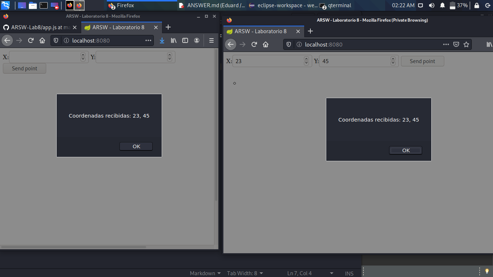
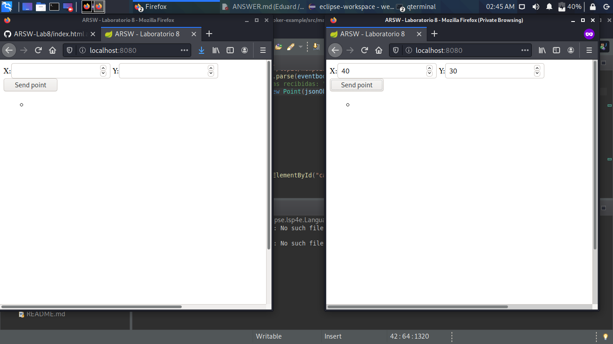

#ARSW - Laboratorio 8
#Broker de Mensajes STOMP con WebSockets + HTML5 Canvas. - Caso: Dibujo Colaborativo Web

## *PARTE I*

1. Se cambió el endpoint a '/topic/newpoint'
2. Se utilizaron dos pestañas en donde claramente se ve quién activó el evento y ambos recibieron la alerta.

## *PARTE II*

1. Como cada uno de los suscritos tiene que dibujar el punto del evento, se removió la responsabilidad a la función `publishPoint` y se le otorgó al callback. Esto con fin de que el suscrito que inicia el evento no dibuje el punto dos veces.

## *PARTE III*

1. 
