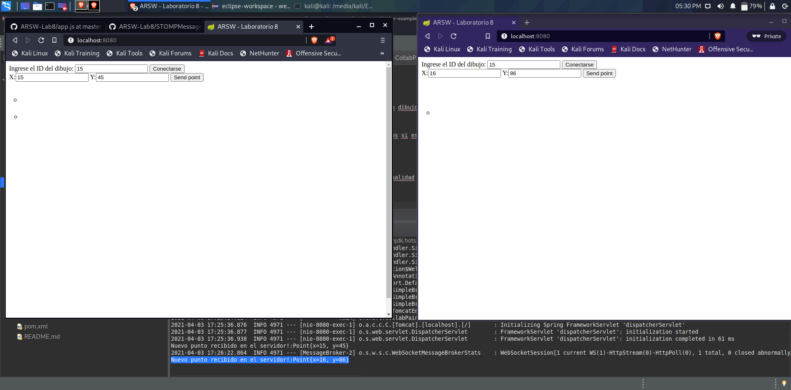

#ARSW - Laboratorio 8
#Broker de Mensajes STOMP con WebSockets + HTML5 Canvas. - Caso: Dibujo Colaborativo Web

## Integrantes:

- Eduard Arias
- James Torres

## *PARTE I*

1. Se cambió el endpoint a '/topic/newpoint'
2. Se utilizaron dos pestañas en donde claramente se ve quién activó el evento y ambos recibieron la alerta.

## *PARTE II*

1. Como cada uno de los suscritos tiene que dibujar el punto del evento, se removió la responsabilidad a la función `publishPoint` y se le otorgó al callback. Esto con fin de que el suscrito que inicia el evento no dibuje el punto dos veces.

## *PARTE III*

1. Se creó un botón que alertará al usuario que se conectó a un dibujo en específico. Además, se cubrieron los casos de valores nulos y NaN.

2. Se muestran los resultados de tres instancias, las cuales dos si estan conectadas.

## *PARTE IV*

1. Se agregó el broker de comunicación del servidor. La funcionalidad quedó intacta.

2. Por el momento, el servidor realiza un flush de los puntos cada vez que envia a dibujar un polígono. Prueba con límite de 3 puntos

3. Por último, la prueba con polígonos de 4 puntos

